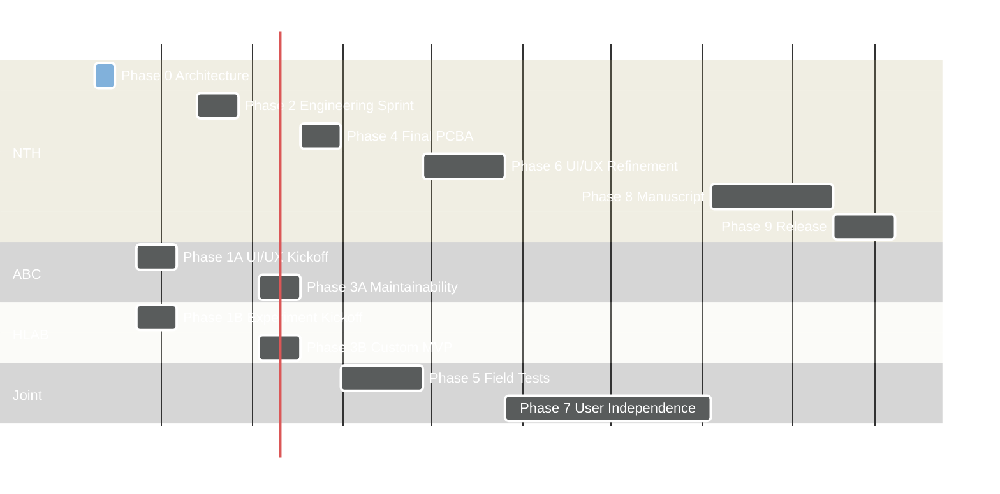

# Spatial Foraging Platform — Project Plan

## Vision

Build, validate, document, and disseminate a modular home-cage platform for
spatially structured ethological behavior, with production-ready hardware,
release-ready software, user documentation, validation datasets, and a
methods/resource manuscript.

## Strategic goals

- Converge on a modular home-cage hardware, firmware, and synchronization
architecture suitable for chronic neural-recording experiments.
- Demonstrate a working MVP custom experiment end-to-end with sync to external
recording hardware.
- Validate the platform in an n=9 module field test and refine UI/UX,
maintenance, and analysis paths based on real use.
- Deliver production-intent PCBAs and a locked BOM that fits within the
McDonnell NRP budget.
- Hand off operation to non-engineering users (ABC and HLAB) operating from
documentation alone.
- Publish a methods/resource manuscript and release the full platform (CAD,
firmware, software, docs, examples) under an open-source license.

## Timeline anchor

**Week 0**: 2026-06-08. All week ranges below derive from this date.

## Current status

| Field           | Value                                   |
| --------------- | --------------------------------------- |
| Phase           | Phase 0 — NTH Architectural Engineering |
| Hardware status | Pre-alpha                               |
| Software status | Pre-alpha                               |

## Phase timeline

## Phase 0 — NTH Architectural Engineering

**Weeks 0–1.** Lead: NTH.

Converge on the hardware, communication, synchronization, and diagnostic
architecture before user-facing design begins. Architecture decisions are
captured in `[docs/](docs/)`, an initial BOM is committed, and an alpha
prototype (n=3 modules plus a base station) is sent to fab.

## Phase 1A — ABC UI/UX Kickoff

**Weeks 2–4.** Lead: ABC. Support: NTH. Parallel with Phase 1B.

Define how a non-engineering user configures, calibrates, runs, monitors, and
maintains the system. The phase produces enough user stories, task templates,
and UI/UX direction for NTH to begin building a mockup.

## Phase 1B — HLAB User Implementation Kickoff

**Weeks 2–4.** Lead: HLAB. Support: NTH. Parallel with Phase 1A.

Define how specialized experiments are authored, executed, synchronized, and
analyzed. The experiment API surface, sync requirements, and at least one MVP
custom experiment are specified for NTH to scaffold against.

## Phase 2 — NTH Engineering Sprint

**Weeks 5–7.** Lead: NTH.

Convert the ABC and HLAB kickoff requirements into a usable prototype stack:
alpha module electronics brought up, base-station communications running,
basic command/event/sync paths working, and a UI/UX mockup ready for ABC
review.

## Phase 3A — ABC UI/UX Feedback + Maintainability

**Weeks 8–10.** Lead: ABC. Support: NTH. Parallel with Phase 3B.

Stress-test the user-facing workflow against the alpha prototype. The phase
captures UI revisions, maintenance interval assumptions, and service /
fault-reporting requirements before final electronics are locked in.

## Phase 3B — HLAB Custom Experiment MVP

**Weeks 8–10.** Lead: HLAB. Support: NTH. Parallel with Phase 3A.

Demonstrate that the platform can run a real custom experiment end-to-end and
synchronize with external recording hardware. A minimal animal assay produces
analyzable output and surfaces the gaps in the API, sync, and analysis paths.

## Phase 4 — NTH Final Engineering Assessment for PCBA

**Weeks 10–12.** Lead: NTH.

Roll alpha-hardware findings, ABC maintainability feedback, and HLAB MVP
feedback into production-intent electronics. Final module and base-station
PCBAs are submitted for assembly and the production-intent BOM is locked.

## Phase 5 — ABC + HLAB Field Tests

**Weeks 12–16.** Leads: ABC + HLAB. Support: NTH.

Run an n=9 module open-field test and evaluate mechanical reliability, sensing
reliability, output quality, and analysis readiness. Remaining UI and API
issues are catalogued, and a simplified analysis workflow is published in the
analysis sub-repository.

## Phase 6 — NTH UI/UX Refinement

**Weeks 16–20.** Lead: NTH.

Incorporate field-test feedback into final module firmware, base-station
software, UI/UX, calibration, fault reporting, sync, and data export. User
and developer documentation reach a complete draft state.

## Phase 7 — ABC + HLAB User Independence

**Weeks 20–30.** Leads: ABC + HLAB. Support: NTH.

Transition from NTH-driven operation to user-driven operation. Final platform
software, developer documentation, and user documentation are released; ABC
and HLAB confirm they can set up, run, calibrate, and diagnose the platform
independently, and feedback is collected for any remaining production
blockers.

## Phase 8 — Manuscript Development

**Weeks 30–36.** Lead: NTH. Support: ABC + HLAB.

Convert the engineering decisions, behavioral validation, electrophysiology /
sync validation, and analysis examples into a methods/resource manuscript.
Sections are assigned, figures prepared, and a complete draft circulated for
review.

## Phase 9 — Final Documentation + Manuscript Submission

**Weeks 36+.** Lead: NTH. Support: ABC + HLAB.

Submit the manuscript and launch the platform as an open-source, supported
NTH resource. CAD, firmware, software, BOM, assembly and calibration guides,
example configurations, and analysis examples are published, and outreach to
other labs begins.