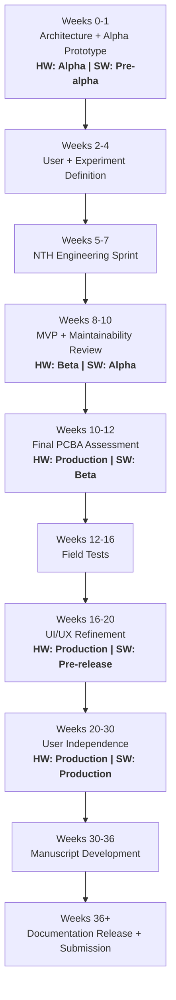

# Spatial Foraging Platform — Project Plan

## Core Objective

Build, validate, document, and disseminate a modular home-cage platform for
spatially structured ethological behavior, with production-ready hardware,
release-ready software, user documentation, validation datasets, and a
manuscript.

## Planning hierarchy

- **Phase** = time window + major readiness state
- **Milestone** = concrete project state reached
- **Objective** = outcome required to reach the milestone
- **Goals** = checkable tasks

## Week 0 anchor

Set `Week 0 = YYYY-MM-DD` once the project officially kicks off. All week
ranges below derive from this date.

> **Week 0**: 2026-06-08

## Current status

| Field           | Value                                       |
| --------------- | ------------------------------------------- |
| Phase           | Phase 0 — NTH Architectural Engineering     |
| Gate            | Pre-G0                                      |
| Hardware status | Pre-alpha                                   |
| Software status | Pre-alpha                                   |

Update this table whenever a phase or gate is crossed.

## Visual milestone map

## Phase gates

| Gate | Week | Hardware    | Software    | Required meaning                                             |
| ---- | ---- | ----------- | ----------- | ------------------------------------------------------------ |
| G0   | 1    | Alpha       | Pre-alpha   | Architecture selected; bench prototypes submitted            |
| G1   | 10   | Beta        | Alpha       | MVP works with at least one custom experiment                |
| G2   | 12   | Production  | Beta        | Final PCBA submitted                                         |
| G3   | 20   | Production  | Pre-release | Field feedback incorporated                                  |
| G4   | 30   | Production  | Production  | Users can operate from documentation                         |
| G5   | 36+  | Production  | Production  | Manuscript submitted; public docs released                   |

---

## Phase 0 — NTH Architectural Engineering

**Weeks 0–1.** Lead: NTH.

**Milestone:** Architecture selected and alpha prototype sent to fab.

### Objective

Converge on the hardware, communication, synchronization, and diagnostic
architecture before user-facing design begins.

### Goals

- [ ] Select communication protocol for module network.
- [ ] Confirm CAN bus topology, connector strategy, addressing, and cable assumptions.
- [ ] Select module MCU, motor driver, pellet sensing, interaction sensing, and LED/status hardware.
- [ ] Select base station hardware.
- [ ] Decide whether synchronization is handled primarily by modules, base station, or both.
- [ ] Define electrophysiology/video sync outputs: TTL, 5V logic, serial messages, timestamps.
- [ ] Define module status indicators: LED states, boot state, fault state, active state, reward state.
- [ ] Draft failure-mode list.
- [ ] Draft function-check procedure for each module.
- [ ] Define how errors, maintenance needs, and failures are reported to users.
- [ ] Create initial architecture diagram.
- [ ] Create initial BOM.
- [ ] Submit alpha PCB/prototype order for n=3 modules plus one base station.

### Exit criteria

- [ ] Architecture decision recorded in [`docs/architecture.md`](docs/architecture.md).
- [ ] Sync decision recorded in [`docs/sync-and-recording.md`](docs/sync-and-recording.md).
- [ ] Alpha BOM committed.
- [ ] Alpha prototype files committed (in the hardware-electronics repo; linked from BOM).
- [ ] Hardware status: Alpha.
- [ ] Software status: Pre-alpha.

---

## Phase 1 — ABC UI/UX Kickoff

**Weeks 2–4.** Lead: ABC. Support: NTH.

**Milestone:** User workflow requirements defined.

### Objective

Define how a non-engineering user configures, calibrates, runs, monitors, and
maintains the system.

### Goals

- [ ] Define primary user interface: web app, desktop app, CLI, config files, or hybrid.
- [ ] Define setup workflow for module layout.
- [ ] Define calibration workflow.
- [ ] Define common task templates.
- [ ] Review FED3-style precedent for task setup and behavioral workflow.
- [ ] Identify where users need flexibility.
- [ ] Identify where users should not have flexibility.
- [ ] Define override needs for advanced users.
- [ ] Define minimum viable UI mockup.
- [ ] Record ABC user stories in [`docs/ui-ux.md`](docs/ui-ux.md).

### Exit criteria

- [ ] NTH has enough information to build UI/UX mockup.
- [ ] Initial user stories committed.
- [ ] Initial task templates listed.

---

## Phase 2 — HLAB User Implementation Kickoff

**Weeks 2–4.** Lead: HLAB. Support: NTH.

**Milestone:** Custom experiment interface defined.

### Objective

Define how specialized experiments are authored, executed, synchronized, and
analyzed.

### Goals

- [ ] Define the experiment "language" or API.
- [ ] Decide whether Python scripting is allowed, required, or optional.
- [ ] Define device functions exposed to users.
- [ ] Define what requires NTH support versus what any lab can implement.
- [ ] Define support-tool BOM for labs.
- [ ] Define required external hardware: cables, adapters, sync boxes, cameras, recording-system I/O.
- [ ] Define minimum viable custom experiment.
- [ ] Define expected behavioral output files.
- [ ] Define expected event/timestamp schema.
- [ ] Record HLAB implementation requirements in [`docs/user-api.md`](docs/user-api.md).

### Exit criteria

- [ ] One MVP experiment is specified.
- [ ] Sync requirements are specified.
- [ ] Support-tool BOM is started.

---

## Phase 3 — NTH Engineering Sprint

**Weeks 5–7.** Lead: NTH.

**Milestone:** Mockup, firmware skeleton, and alpha bench-test plan ready.

### Objective

Convert kickoff requirements into a usable prototype stack.

### Goals

- [ ] Bring up alpha module electronics.
- [ ] Bring up base station communications.
- [ ] Implement module discovery.
- [ ] Implement basic module command set.
- [ ] Implement reward delivery command.
- [ ] Implement event logging.
- [ ] Implement basic sync output.
- [ ] Implement module self-test.
- [ ] Implement fault-reporting skeleton.
- [ ] Create minimal UI/UX mockup.
- [ ] Create bench-test checklist.
- [ ] Update BOM with alpha findings.

### Exit criteria

- [ ] NTH can demonstrate basic module control.
- [ ] UI mockup is ready for ABC feedback.
- [ ] MVP custom experiment is ready for HLAB attempt.

---

## Phase 4 — ABC UI/UX Feedback + Maintainability

**Weeks 8–10.** Lead: ABC. Support: NTH.

**Milestone:** Maintainability and user feedback captured.

### Objective

Stress-test the user-facing workflow and identify cleaning, access, service,
and replacement issues.

### Goals

- [ ] Review UI/UX mockup.
- [ ] Identify confusing setup steps.
- [ ] Identify missing calibration tools.
- [ ] Review physical access to modules.
- [ ] Review cleaning workflow.
- [ ] Identify likely broken or replaceable components.
- [ ] Define maintenance interval assumptions.
- [ ] Define user-facing service alerts.
- [ ] Define what failures can be detected automatically.
- [ ] Define what failures require manual inspection.
- [ ] Update [`docs/maintenance.md`](docs/maintenance.md).
- [ ] Update [`docs/failure-modes.md`](docs/failure-modes.md).

### Exit criteria

- [ ] UI revisions are prioritized.
- [ ] Maintainability requirements are documented.
- [ ] Service/fault-reporting requirements are documented.

---

## Phase 5 — HLAB Custom Experiment MVP

**Weeks 8–10.** Lead: HLAB. Support: NTH.

**Milestone:** One custom experiment runs end-to-end.

### Objective

Demonstrate that the platform can run a real custom experiment and synchronize
with external recording systems.

### Goals

- [ ] Implement one custom experiment.
- [ ] Run module commands from the experiment interface.
- [ ] Log behavioral events.
- [ ] Produce analyzable output.
- [ ] Attempt TTL sync with external recording hardware.
- [ ] Attempt serial or timestamped sync if applicable.
- [ ] Run minimal behavioral assay with animals.
- [ ] Identify missing API features.
- [ ] Identify missing sync features.
- [ ] Identify missing analysis features.

### Exit criteria

- [ ] MVP custom experiment demonstrated.
- [ ] Sync pathway tested.
- [ ] Minimal animal assay completed.
- [ ] Hardware status: Beta.
- [ ] Software status: Alpha.

---

## Phase 6 — NTH Final Engineering Assessment for PCBA

**Weeks 10–12.** Lead: NTH.

**Milestone:** Final PCBAs submitted.

### Objective

Convert prototype lessons into production-intent electronics and unit
economics.

### Goals

- [ ] Review alpha hardware issues.
- [ ] Review ABC maintainability feedback.
- [ ] Review HLAB MVP feedback.
- [ ] Finalize module PCB.
- [ ] Finalize base station PCB or interface hardware.
- [ ] Finalize connector strategy.
- [ ] Finalize power strategy.
- [ ] Finalize sensor strategy.
- [ ] Finalize LED/status indicators.
- [ ] Finalize programming/debug access.
- [ ] Update unit economics.
- [ ] Determine quantity based on budget.
- [ ] Submit final PCBAs for assembly.

### Exit criteria

- [ ] Final PCBA files submitted.
- [ ] Production-intent BOM committed.
- [ ] Hardware status: Production.
- [ ] Software status: Beta.

---

## Phase 7 — ABC + HLAB Field Tests

**Weeks 12–16.** Leads: ABC + HLAB. Support: NTH.

**Milestone:** n=9 module field test completed.

### Objective

Test the platform in an open-field arrangement and evaluate behavior,
usability, output quality, and analysis readiness.

### Goals

- [ ] Deliver n=9 modules.
- [ ] Define open-field arrangement.
- [ ] Run simple longitudinal behavior test.
- [ ] Evaluate mechanical reliability.
- [ ] Evaluate pellet delivery reliability.
- [ ] Evaluate interaction sensing reliability.
- [ ] Evaluate data output quality.
- [ ] Evaluate interpretability of output.
- [ ] Identify remaining UI/UX issues.
- [ ] Identify remaining API issues.
- [ ] Create simplified analysis workflow.
- [ ] Publish analysis scripts in the analysis sub-repository.

### Exit criteria

- [ ] Field test completed.
- [ ] Analysis workflow exists.
- [ ] Remaining release blockers are listed.

---

## Phase 8 — NTH UI/UX Refinement

**Weeks 16–20.** Lead: NTH.

**Milestone:** Pre-release software complete.

### Objective

Incorporate field-test feedback into final module firmware, base station
software, and user interface.

### Goals

- [ ] Refine module firmware.
- [ ] Refine base station software.
- [ ] Refine UI/UX.
- [ ] Refine calibration workflow.
- [ ] Refine task templates.
- [ ] Refine fault reporting.
- [ ] Refine sync tools.
- [ ] Refine data export format.
- [ ] Update user documentation.
- [ ] Update developer documentation.

### Exit criteria

- [ ] Hardware status: Production.
- [ ] Software status: Pre-release.
- [ ] User documentation draft complete.
- [ ] Developer documentation draft complete.

---

## Phase 9 — ABC + HLAB User Independence

**Weeks 20–30.** Leads: ABC + HLAB. Support: NTH.

**Milestone:** Users operate from documentation.

### Objective

Transition from NTH-driven operation to user-driven operation with
collaborative feedback.

### Goals

- [ ] Release final platform software.
- [ ] Release developer documentation.
- [ ] Release user documentation.
- [ ] Confirm users can set up modules independently.
- [ ] Confirm users can run experiments independently.
- [ ] Confirm users can calibrate independently.
- [ ] Confirm users can diagnose basic failures independently.
- [ ] Collect user feedback through email, issues, or direct repository collaboration.
- [ ] Resolve production blockers.
- [ ] Freeze manuscript-ready hardware/software description.

### Exit criteria

- [ ] Hardware status: Production.
- [ ] Software status: Production.
- [ ] User independence demonstrated.
- [ ] Manuscript figures/data plan finalized.

---

## Phase 10 — Manuscript Development

**Weeks 30–36.** Lead: NTH. Support: ABC + HLAB.

**Milestone:** Manuscript draft complete.

### Objective

Convert engineering, validation, user feedback, and analysis into a
methods/resource manuscript.

### Goals

- [ ] Select publication route.
- [ ] Create manuscript outline.
- [ ] Assign writing sections.
- [ ] Draft engineering methods.
- [ ] Draft behavioral validation.
- [ ] Draft electrophysiology/sync validation.
- [ ] Draft analysis examples.
- [ ] Prepare figures.
- [ ] Prepare repository/documentation statement.
- [ ] Invite real-time collaboration.
- [ ] Complete full manuscript draft.

### Exit criteria

- [ ] Manuscript draft complete.
- [ ] All parties have reviewed.
- [ ] Submission target selected.

---

## Phase 11 — Final Documentation + Manuscript Submission

**Weeks 36+.** Lead: NTH. Support: ABC + HLAB.

**Milestone:** Public release.

### Objective

Submit the manuscript and launch the platform as an open-source, supported
NTH resource.

### Goals

- [ ] Submit manuscript.
- [ ] Launch official documentation.
- [ ] Release CAD files.
- [ ] Release firmware.
- [ ] Release software.
- [ ] Release BOM.
- [ ] Release assembly guide.
- [ ] Release calibration guide.
- [ ] Release example configurations.
- [ ] Release analysis examples.
- [ ] Begin outreach to other labs.
- [ ] Continue support through regular NTH operations.

### Exit criteria

- [ ] Manuscript submitted.
- [ ] Public repository usable by external labs.
- [ ] NTH support pathway defined.
