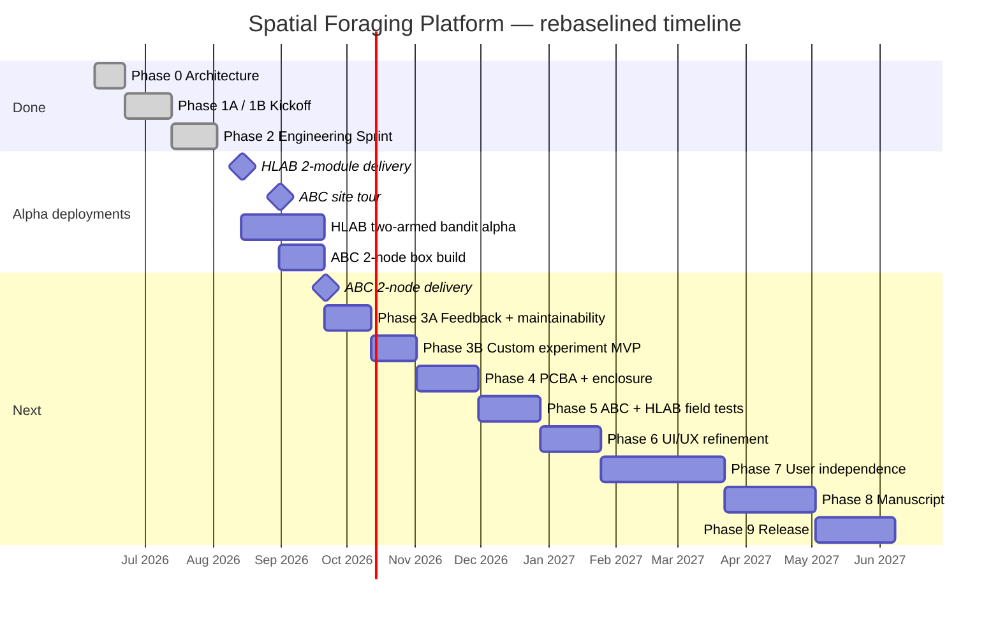
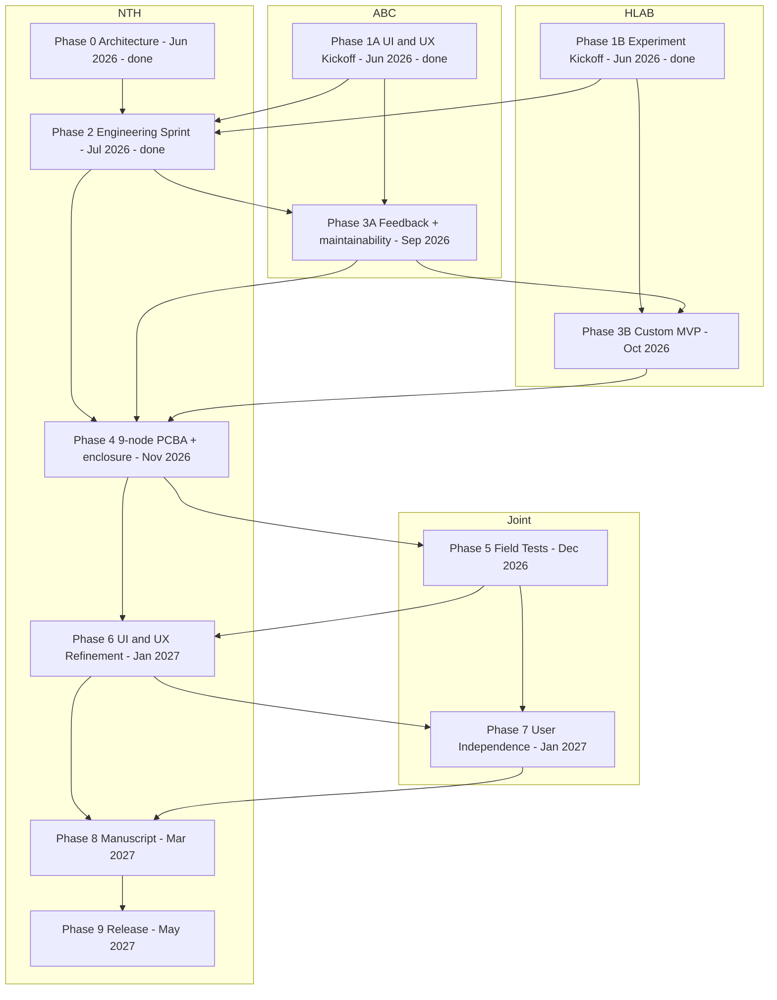

# Spatial Foraging Platform — Project Plan

## Vision

Build, validate, document, and disseminate a modular home-cage platform for
spatially structured ethological behavior, with production-ready hardware,
release-ready software, user documentation, validation datasets, and a
methods/resource manuscript.

## Strategic goals

- Converge on a modular home-cage hardware, firmware, and synchronization
architecture suitable for chronic neural-recording experiments.
- Demonstrate a working MVP custom experiment end-to-end with sync to external
recording hardware.
- Validate the platform in an n=9 module field test and refine UI/UX,
maintenance, and analysis paths based on real use.
- Deliver production-intent PCBAs and a locked BOM that fits within the
McDonnell NRP budget.
- Hand off operation to non-engineering users (ABC and HLAB) operating from
documentation alone.
- Publish a methods/resource manuscript and release the full platform (CAD,
firmware, software, docs, examples) under an open-source license.

## Timeline anchor

**Week 0**: 2026-06-08. All week ranges below derive from this date.

**Rebaseline (2026-09-16):** Phases 3A–9 slipped. HLAB has been on a
two-module alpha setup since 2026-08-14; ABC’s matching two-node behavior
box is due Week 15. Production 9-node PCBAs and joint field tests have
**not** started. Week numbers for Phase 3A onward below replace the original
Aug 2026 field-test plan.

## Current status

| Field           | Value                                                                  |
| --------------- | ---------------------------------------------------------------------- |
| Phase           | Phase 3A starts Week 15 — ABC two-node behavior box                    |
| Hardware status | Alpha (HLAB 2-module live; ABC 2-node due next week)                   |
| Software status | Alpha                                                                  |
| Week            | Week 14 (as of 2026-09-16)                                             |

Weekly shipped / blocked / next: [`pulse/log.md`](pulse/log.md). Cross-lab
events: [`meetings/`](meetings/).

## Phase timeline

| Phase | Lead | Weeks | Calendar | Status |
| ----- | ---- | ----- | -------- | ------ |
| 0 Architecture | NTH | 0–1 | Jun 8–21, 2026 | Done |
| 1A UI/UX Kickoff | ABC | 2–4 | Jun 22–Jul 12, 2026 | Done |
| 1B Experiment Kickoff | HLAB | 2–4 | Jun 22–Jul 12, 2026 | Done |
| 2 Engineering Sprint | NTH | 5–7 | Jul 13–Aug 2, 2026 | Done |
| Alpha two-module deployments | NTH | 8–14 | Aug 3–Sep 20, 2026 | Closing (HLAB live; ABC box in build) |
| 3A Feedback + maintainability | ABC + HLAB | 15–17 | Sep 21–Oct 11, 2026 | Next |
| 3B Custom experiment MVP | HLAB | 18–20 | Oct 12–Nov 1, 2026 | Planned |
| 4 9-node PCBA + enclosure | NTH + HLAB | 21–24 | Nov 2–Nov 29, 2026 | Planned (boards 3–4 weeks) |
| 5 Field tests | ABC + HLAB | 25–28 | Nov 30–Dec 27, 2026 | Planned |
| 6 UI/UX refinement | NTH | 29–32 | Dec 28, 2026–Jan 24, 2027 | Planned |
| 7 User independence | ABC + HLAB | 33–40 | Jan 25–Mar 21, 2027 | Planned |
| 8 Manuscript | NTH | 41–46 | Mar 22–May 2, 2027 | Planned |
| 9 Release | NTH + ABC + HLAB | 47+ | May 2027+ | Planned |

```mermaid
gantt
  title Spatial Foraging Platform — rebaselined timeline
  dateFormat YYYY-MM-DD
  axisFormat %b %Y

  section Done
  Phase 0 Architecture           :done, p0, 2026-06-08, 2026-06-22
  Phase 1A / 1B Kickoff          :done, p1, 2026-06-22, 2026-07-13
  Phase 2 Engineering Sprint     :done, p2, 2026-07-13, 2026-08-03

  section Alpha deployments
  HLAB 2-module delivery         :milestone, m_hlab, 2026-08-14, 1d
  ABC site tour                  :milestone, m_abc_tour, 2026-08-31, 1d
  HLAB two-armed bandit alpha    :p_hlab, 2026-08-14, 2026-09-21
  ABC 2-node box build           :p_abc_build, 2026-08-31, 2026-09-21

  section Next
  ABC 2-node delivery            :milestone, m_abc, 2026-09-21, 1d
  Phase 3A Feedback + maintainability :p3a, 2026-09-21, 2026-10-12
  Phase 3B Custom experiment MVP :p3b, 2026-10-12, 2026-11-02
  Phase 4 PCBA + enclosure       :p4, 2026-11-02, 2026-11-30
  Phase 5 ABC + HLAB field tests :p5, 2026-11-30, 2026-12-28
  Phase 6 UI/UX refinement       :p6, 2026-12-28, 2027-01-25
  Phase 7 User independence      :p7, 2027-01-25, 2027-03-22
  Phase 8 Manuscript             :p8, 2027-03-22, 2027-05-03
  Phase 9 Release                :p9, 2027-05-03, 2027-06-08
```

```mermaid
flowchart TB
  subgraph nth [NTH]
    p0["Phase 0 Architecture - Jun 2026 - done"]
    p2["Phase 2 Engineering Sprint - Jul 2026 - done"]
    p4["Phase 4 9-node PCBA + enclosure - Nov 2026"]
    p6["Phase 6 UI and UX Refinement - Jan 2027"]
    p8["Phase 8 Manuscript - Mar 2027"]
    p9["Phase 9 Release - May 2027"]
    p0 --> p2 --> p4 --> p6 --> p8 --> p9
  end

  subgraph abc [ABC]
    p1a["Phase 1A UI and UX Kickoff - Jun 2026 - done"]
    p3a["Phase 3A Feedback + maintainability - Sep 2026"]
    p1a --> p3a
  end

  subgraph hlab [HLAB]
    p1b["Phase 1B Experiment Kickoff - Jun 2026 - done"]
    p3b["Phase 3B Custom MVP - Oct 2026"]
    p1b --> p3b
  end

  subgraph joint [Joint]
    p5["Phase 5 Field Tests - Dec 2026"]
    p7["Phase 7 User Independence - Jan 2027"]
    p5 --> p7
  end

  p1a --> p2
  p1b --> p2
  p2 --> p3a
  p3a --> p3b
  p3a --> p4
  p3b --> p4
  p4 --> p5
  p5 --> p6
  p6 --> p7
  p7 --> p8
```

## Phase 0 — NTH Architectural Engineering

**Weeks 0–1.** Lead: NTH. **Done.**

Converge on the hardware, communication, synchronization, and diagnostic
architecture before user-facing design begins. Architecture decisions are
captured in `[docs/](docs/)`, an initial BOM is committed, and an alpha
prototype (n=3 modules plus a base station) is sent to fab.

## Phase 1A — ABC UI/UX Kickoff

**Weeks 2–4.** Lead: ABC. Support: NTH. Parallel with Phase 1B. **Done.**

Define how a non-engineering user configures, calibrates, runs, monitors, and
maintains the system. The phase produces enough user stories, task templates,
and UI/UX direction for NTH to begin building a mockup.

## Phase 1B — HLAB User Implementation Kickoff

**Weeks 2–4.** Lead: HLAB. Support: NTH. Parallel with Phase 1A. **Done.**

Define how specialized experiments are authored, executed, synchronized, and
analyzed. The experiment API surface, sync requirements, and at least one MVP
custom experiment are specified for NTH to scaffold against.

## Phase 2 — NTH Engineering Sprint

**Weeks 5–7.** Lead: NTH. **Done.**

Convert the ABC and HLAB kickoff requirements into a usable prototype stack:
alpha module electronics brought up, base-station communications running,
basic command/event/sync paths working, and a UI/UX mockup ready for ABC
review. The 2026-07-21 joint meeting locked pellet-presence sensing and
experiment-task support into that plan.

**Weeks 8–14 (alpha deployments, not a numbered phase).** HLAB received a
two-module two-armed-bandit setup on 2026-08-14; the analysis SDK followed
about a week later. ABC toured on 2026-08-31 and chose to replicate the
Hengen Lab behavior-box assembly. ABC’s first two-node box is due Week 15.

## Phase 3A — ABC + HLAB Feedback + Maintainability

**Weeks 15–17 (2026-09-21 to 2026-10-11).** Leads: ABC + HLAB. Support: NTH.

ABC receives its first two-node behavior box (same recipe as the HLAB pair)
and both labs start using the alpha hardware in earnest. Customize
experiments to what each lab actually runs, collect UI/UX and
maintainability feedback, and lock cleaning / service assumptions before
custom-MVP work and production electronics.

Exit: ABC two-node box in daily use; written feedback from ABC and HLAB on
experiments, maintenance, and cleaning; open issues triaged for 3B vs 4 vs 6.

## Phase 3B — HLAB Custom Experiment MVP

**Weeks 18–20 (2026-10-12 to 2026-11-01).** Lead: HLAB. Support: NTH. Follows
Phase 3A.

Demonstrate that the platform can run a real custom experiment end-to-end and
synchronize with external recording hardware. A minimal animal assay produces
analyzable output and surfaces the gaps in the API, sync, and analysis paths.

Exit: one custom experiment running on HLAB hardware with analyzable session
output; API / sync gaps listed for Phase 4 and Phase 6.

## Phase 4 — NTH 9-node PCBA + Enclosure Platform

**Weeks 21–24 (2026-11-02 to 2026-11-29).** Lead: NTH. Support: HLAB.

After the custom-experiment MVP, NTH places the **9-node module PCBA**. Board
turnaround is **3–4 weeks**. While boards are in fab, NTH prepares the
platform (firmware, base station, docs, fixtures), and **Hengen Lab + NTH
design the enclosure platform** for the 9-node array. Production-intent BOM
is locked against the McDonnell NRP budget.

Exit: 9-node PCBAs in hand (or in incoming inspection); enclosure design
ready to fabricate; BOM locked.

## Phase 5 — ABC + HLAB Field Tests

**Weeks 25–28 (2026-11-30 to 2026-12-27).** Leads: ABC + HLAB. Support: NTH.

Run an n=9 module field test once boards and the enclosure platform are
ready. Evaluate mechanical reliability, sensing reliability, output quality,
and analysis readiness. Remaining UI and API issues are catalogued, and the
simplified analysis workflow remains
`[sfm-analysis](https://github.com/Neurotech-Hub/SFM/tree/main/packages/sfm-analysis)`
(`pip install sfm-analysis`).

## Phase 6 — NTH UI/UX Refinement

**Weeks 29–32 (2026-12-28 to 2027-01-24).** Lead: NTH.

Incorporate field-test feedback into final module firmware, base-station
software, UI/UX, calibration, fault reporting, sync, and data export. User
and developer documentation reach a complete draft state.

## Phase 7 — ABC + HLAB User Independence

**Weeks 33–40 (2027-01-25 to 2027-03-21).** Leads: ABC + HLAB. Support: NTH.

Transition from NTH-driven operation to user-driven operation. Final platform
software, developer documentation, and user documentation are released; ABC
and HLAB confirm they can set up, run, calibrate, and diagnose the platform
independently, and feedback is collected for any remaining production
blockers.

## Phase 8 — Manuscript Development

**Weeks 41–46 (2027-03-22 to 2027-05-02).** Lead: NTH. Support: ABC + HLAB.

Convert the engineering decisions, behavioral validation, electrophysiology /
sync validation, and analysis examples into a methods/resource manuscript.
Sections are assigned, figures prepared, and a complete draft circulated for
review.

## Phase 9 — Final Documentation + Manuscript Submission

**Weeks 47+ (2027-05-03 onward).** Lead: NTH. Support: ABC + HLAB.

Submit the manuscript and launch the platform as an open-source, supported
NTH resource. CAD, firmware, software, BOM, assembly and calibration guides,
example configurations, and analysis examples are published, and outreach to
other labs begins.
