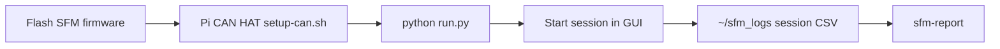

# Spatial Foraging Platform

A modular home-cage platform that converts the cage floor into a programmable
foraging environment for freely moving rodents. Distributed reward delivery and
spatial cueing within a scalable, synchronized architecture enable continuous,
ethologically grounded behavior compatible with chronic neural recordings.

**[View design (Fusion 360)](https://a360.co/4dwOh8e)** — 3D model and mounting
outline. Mounting DXF and fastener notes live in [`hardware/`](hardware/).

This repository is the **planning, documentation, and manuscript hub** for the
project. Firmware, base-station GUI, and analysis code live in
[Neurotech-Hub/SFM](https://github.com/Neurotech-Hub/SFM) and are linked from
the [Related repositories](#related-repositories) table below.

Funded by the McDonnell Center NRP (PI: Gaidica). Total budget: $40,000 over 12
months. See [`references/McDonnell-NRP_GAIDICA.pdf`](references/McDonnell-NRP_GAIDICA.pdf)
for the funded proposal.

## Current status


| Field           | Value                                                        |
| --------------- | ------------------------------------------------------------ |
| Phase           | Phase 3A — ABC box installed; experiments wait on protocol   |
| Hardware status | Alpha (HLAB 2-module live; ABC 2-node set up 2026-09-30)     |
| Software status | Alpha (sensors, logging, and reports behaving at ABC)        |
| Week            | Week 16 (as of 2026-09-30; see [`PROJECT.md`](PROJECT.md))   |


## Quick links

- [`PROJECT.md`](PROJECT.md) — master roadmap: phases, milestones, exit criteria, checkbox tasks
- [Operations](#operations) — flash firmware, bring up the Pi, run a session, generate reports
- [`docs/`](docs/) — design + requirements documents (architecture, dispense cycle, sync, UI/UX, calibration, etc.)
- [`docs/dispense-cycle.md`](docs/dispense-cycle.md) — dispense cycle flowchart, sensor pinouts, CAN events, and heartbeat snapshot
- [`docs/user-api.md`](docs/user-api.md) — experiment API, session CSV schema, and behavior reports
- [`docs/function-checks.md`](docs/function-checks.md) — pre-session bring-up checklist
- [`hardware/`](hardware/) — hardware design artifacts (e.g. 3D / DXF)
- [`meetings/`](meetings/) — cross-lab meeting notes
- [`pulse/`](pulse/) — weekly progress (shipped / in progress / blocked)
- [`bom/`](bom/) — budget tracking against the $40k grant
- [`references/`](references/) — grant proposal and source planning documents
- [`manuscript/`](manuscript/) — manuscript drafting (Phase 8+)
- [`CONTRIBUTING.md`](CONTRIBUTING.md) — how to contribute


## Collaborators


| Lab                        | Role                                                                                       | Lead         | GitHub |
| -------------------------- | ------------------------------------------------------------------------------------------ | ------------ | ------ |
| Neurotech Hub (NTH)        | Engineering lead — electronics, firmware, host UI, fabrication, integration, dissemination | Matt Gaidica, PhD | TBD    |
| Animal Behavior Core (ABC) | UI/UX feedback, common task structures, behavioral benchmarking, animal metrics report     | Susan Maloney, PhD         | TBD    |
| Hengen Lab (HLAB)          | Custom experiment authoring, in vivo electrophysiology validation, recording sync          | Keith Hengen, PhD | TBD    |


## Related repositories

The repositories below hold the actual artifacts produced by this project. This
planning repo links to them; it does not contain their source.

Firmware, GUI, and analysis all live in **[Neurotech-Hub/SFM](https://github.com/Neurotech-Hub/SFM)**
(formerly VFM).


| Domain                  | Repository                                                                                                                                     | Owner      | Status                                      |
| ----------------------- | ---------------------------------------------------------------------------------------------------------------------------------------------- | ---------- | ------------------------------------------- |
| Mechanical / CAD        | TBD                                                                                                                                            | NTH        | TBD                                         |
| Electronics / PCB       | TBD                                                                                                                                            | NTH        | TBD                                         |
| Module firmware         | [SFM `firmware/`](https://github.com/Neurotech-Hub/SFM/tree/main/firmware)                                                                     | NTH        | Active — Arduino library `SFM` (ESP32-S3)   |
| Base station / host UI  | [SFM `packages/dev_gui`](https://github.com/Neurotech-Hub/SFM/tree/main/packages/dev_gui)                                                      | NTH        | Active — DearPyGui + CAN tooling            |
| Experiment API          | [experiment engine](https://github.com/Neurotech-Hub/SFM/tree/main/packages/dev_gui/base_station/experiment)                                   | NTH / HLAB | Built-in templates; custom via copy-from    |
| Analysis / reports      | [sfm-analysis](https://github.com/Neurotech-Hub/SFM/tree/main/packages/sfm-analysis) ([PyPI](https://pypi.org/project/sfm-analysis/))           | NTH / ABC  | Active — `pip install sfm-analysis`         |


When a CAD or PCB repo comes online, replace `TBD` with the URL and update the
status column.

## Operations

Operator path from a flashed node to a printable report. Long-form install and
troubleshooting live in SFM; this section is the hub.



All commands below assume a clone of [Neurotech-Hub/SFM](https://github.com/Neurotech-Hub/SFM).
CAN bitrate is **250 kbps**. Pre-session checks:
[`docs/function-checks.md`](docs/function-checks.md).

### Firmware

The Arduino library is `firmware/` (not the repo root). Copy or symlink it to
`Arduino/libraries/SFM`, or zip that folder and add it via *Sketch → Include
Library → Add .ZIP Library…*. Pin map:
[firmware/docs/WIRING.md](https://github.com/Neurotech-Hub/SFM/blob/main/firmware/docs/WIRING.md).
Dispense cycle:
[firmware/docs/DISPENSE_CYCLE.md](https://github.com/Neurotech-Hub/SFM/blob/main/firmware/docs/DISPENSE_CYCLE.md).

### One-time Raspberry Pi CAN HAT bring-up

Do this once per Pi before running against real hardware:

```bash
cd packages/dev_gui/deploy
sudo ./setup-can.sh            # reboots automatically if needed
sudo ./setup-can.sh --verify   # confirm can0 is healthy after reboot
```

Details: [deploy/README.md](https://github.com/Neurotech-Hub/SFM/blob/main/packages/dev_gui/deploy/README.md).
HAT pin-by-pin check (from `packages/dev_gui`): `python tests/test_hat.py`.

### Install and run the GUI

```bash
cd packages/dev_gui
pip install -r requirements.txt --break-system-packages
python run.py                  # real hardware on can0; logs default to ~/sfm_logs
```

Simulator (no hardware):

```bash
sudo modprobe vcan
sudo ip link add dev vcan0 type vcan
sudo ip link set up vcan0
# Terminal 1
python node_simulator.py --interface vcan0 --nodes 3
# Terminal 2
python run.py --interface vcan0 --nodes 3
```

GUI README: [packages/dev_gui/README.md](https://github.com/Neurotech-Hub/SFM/blob/main/packages/dev_gui/README.md).

### Run a session

In the GUI: pick a template, enter a session name, click Start. Session
activate broadcasts `SyncFlash` (every online node’s status LED solid ON for
500 ms) and fires a coincident BNC OUT pulse. Logs append to
`<log_dir>/<session_name>.csv` (default `~/sfm_logs`).

The base station stores MAC↔Node ID mappings in `~/.sfm/mac_id_registry.json`.
**Re-discover** in the GUI clears that file, broadcasts `ClearId` to node NVS,
and rediscovers from scratch.

### Behavior reports

Reports run on **any** workstation — Windows, macOS, or Linux. No Raspberry Pi
or hardware libraries. Install the SDK:

```bash
pip install sfm-analysis
```

```bash
sfm-report --demo --open                 # bundled demo; no rig or logs needed
sfm-report --list
sfm-report EXP-Test-02 --open
sfm-report "cohortA_*" --combine -o /tmp/cohortA.html
```

On the Pi, `python run_report.py` (from `packages/dev_gui`) is a thin wrapper
around the same CLI and uses the base station’s log-directory auto-detection
(external drive, else `~/sfm_logs`).

Canonical docs: [sfm-analysis README](https://github.com/Neurotech-Hub/SFM/blob/main/packages/sfm-analysis/README.md)
and [ANALYSIS_GUIDE.md](https://github.com/Neurotech-Hub/SFM/blob/main/packages/sfm-analysis/docs/ANALYSIS_GUIDE.md).
Experiment API and CSV schema: [`docs/user-api.md`](docs/user-api.md).


| Design                 | When it applies                         | Extra sections                                       |
| ---------------------- | --------------------------------------- | ---------------------------------------------------- |
| `default`              | Any session (fallback)                  | Pellet accounting, latency, presence, funnel, faults |
| `free_feeding`         | `free_feeding` template                 | Intake rate, reload delays                           |
| `fixed_and_random`     | `fixed_and_random` template             | Per-node role (off / fixed / random)                 |
| `probability_delivery` | `probability_delivery` template         | Delivery-site distribution                           |
| `two_armed_bandit`     | `two_armed_bandit` template             | Choice, block/reversal curves, WSLS                  |


`--combine` builds a comparative report (cohort table, learning curve, quality
matrix). Time alignment: `relative` (default), `wall`, `trial`, or `event:<name>`.
JSON export is planned (`--json`); metrics are already computed separately from HTML.

## How to read this repo

If you are new here, read in this order:

1. This README — what we are building, where artifacts live, and how to operate.
2. [`PROJECT.md`](PROJECT.md) — current phase, what is in flight, what is next.
3. [`pulse/log.md`](pulse/log.md) — weekly shipped / in progress / blocked.
4. [`docs/architecture.md`](docs/architecture.md) — system architecture.
5. The relevant `docs/*.md` for your role (e.g. ABC: `ui-ux.md`, `maintenance.md`; HLAB: `user-api.md`, `sync-and-recording.md`).


## Abbreviations

Abbreviations used throughout this repository.

### Collaborators


| Abbreviation | Expansion            |
| ------------ | -------------------- |
| ABC          | Animal Behavior Core |
| HLAB         | Hengen Lab           |
| NTH          | Neurotech Hub        |


### Project / process


| Abbreviation | Expansion                                                                 |
| ------------ | ------------------------------------------------------------------------- |
| BOM          | Bill of Materials                                                         |
| HW           | Hardware (status field)                                                   |
| MVP          | Minimum Viable Product                                                    |
| SFM          | Spatial Foraging Module / [Neurotech-Hub/SFM](https://github.com/Neurotech-Hub/SFM) software repo |
| SW           | Software (status field)                                                   |
| VFM          | Former name of SFM (GitHub repo renamed 2026-08-27)                       |


### Hardware / electronics


| Abbreviation | Expansion                                               |
| ------------ | ------------------------------------------------------- |
| CAD          | Computer-Aided Design                                   |
| CAN          | Controller Area Network (bus)                           |
| LED          | Light-Emitting Diode                                    |
| MCU          | Microcontroller Unit                                    |
| PCB          | Printed Circuit Board                                   |
| PCBA         | Printed Circuit Board Assembly                          |
| TTL          | Transistor-Transistor Logic (digital sync signal level) |


### Software / interfaces


| Abbreviation | Expansion                         |
| ------------ | --------------------------------- |
| API          | Application Programming Interface |
| CLI          | Command-Line Interface            |
| UI           | User Interface                    |
| UX           | User Experience                   |


### External references


| Abbreviation | Expansion                                                                 |
| ------------ | ------------------------------------------------------------------------- |
| FED3         | Feeding Experimentation Device 3 (open-source rodent feeder, Kravitz lab) |


## License

Documentation, plans, and manuscript content in this repository are released
under [CC-BY-4.0](LICENSE). Code in linked sub-repositories carries its own
licensing.
