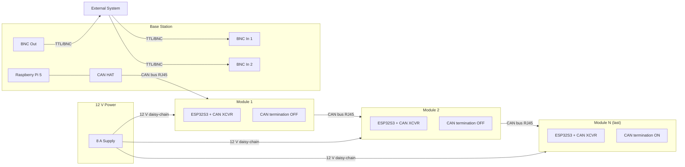

# Architecture

Captures the integrated system architecture for the platform.

## System overview

The Spatial Foraging Platform is a modular, network-connected behavioral apparatus
consisting of a Raspberry Pi 5 base station and up to N foraging modules (reference
deployment: 9 modules) connected over a CAN bus in a linear daisy-chain. Each
foraging module is an independent unit housing an ESP32S3, two stepper-motor pellet
dispensers, a beam-break and capacitive-touch sensing suite, and status LEDs. The base
station orchestrates node discovery, session management, event logging, and
synchronization with external recording systems via BNC I/O. All modules are powered
from a single 12 V supply routed through the daisy-chain; the base station is powered
separately via USB-C.



## Communication protocol

CAN bus was selected as the module network protocol for the following reasons:

- **Noise immunity** — differential signalling is robust over the cable lengths
  typical in a home-cage arena.
- **Bus topology** — all nodes share a single cable run; individual node wiring is
  minimised.
- **Built-in error handling** — CAN hardware provides automatic retransmission, error
  frames, and bus-off detection without requiring application-layer redundancy.
- **Peer-to-peer broadcasting** — any node can broadcast events to all other nodes and
  to the base station simultaneously.

## CAN bus topology

### Physical topology

Linear bus topology. RJ45/Ethernet connectors carry CAN signals (CAN_H, CAN_L),
12 V power, GND, and addressing GPIOs (AEO/AEI) in a daisy-chain from the base
station through every module.

### Termination

CAN requires a 120 Ω termination resistor at each end of the bus.

| End | Termination method |
| --- | ------------------ |
| Base station | Fixed 120 Ω resistor on the CAN HAT |
| Last node | Automatic via hardware logic |

The automatic termination on the last node works as follows: when the node's CAN-out
RJ45 port is **unplugged**, hardware logic (a physical switch or pull) asserts the
termination resistor. When the port is plugged in and continues the chain, termination
is disabled. No firmware intervention is required.

### Addressing and discovery

Each node's UUID is its ESP32S3 MAC address. The base station assigns a logical Node ID
(1-based integer) during discovery and stores the UUID↔ID mapping in its registry.
Each node stores its assigned ID in ESP32S3 NVS (non-volatile storage) so it persists
across power cycles.

Discovery uses a daisy-chain Address Enable signal. Each module has:

- **AEO** — Address Enable Out (drives the next node's AEI).
- **AEI** — Address Enable In (gates whether the node participates in the current
  discovery step).

#### First boot — all nodes have empty NVS

```
Base          Node A (NVS: empty)     Node B (NVS: empty)     Node C (NVS: empty)
  │                   │                        │                        │
  │  ════════════════ FIRST BOOT (all nodes are new) ═══════════════    │
  │                   │                        │                        │
  ├──AEO HIGH────────►│ AEI=HIGH               │ AEI=LOW               │ AEI=LOW
  │                   │                        │ (blocked)              │ (blocked)
  │                   │ "I have no saved ID"   │                        │
  │                   │                        │                        │
  │◄──ANNOUNCE(UUID_A)│                        │                        │
  │                   │                        │                        │
  ├──ASSIGN(UUID_A,1)►│                        │                        │
  │                   │ save {UUID_A,1} to NVS │                        │
  │◄──ACK(1)──────────│                        │                        │
  │                   │                        │                        │
  │                   ├──AEO HIGH─────────────►│ AEI=HIGH               │ AEI=LOW
  │                   │                        │ "I have no saved ID"   │ (blocked)
  │                   │                        │                        │
  │◄──────────────────────ANNOUNCE(UUID_B)─────│                        │
  │                   │                        │                        │
  ├────────────────────────ASSIGN(UUID_B,2)───►│                        │
  │                   │                        │ save {UUID_B,2} to NVS │
  │◄──────────────────────ACK(2)───────────────│                        │
  │                   │                        │                        │
  │                   │                        ├──AEO HIGH─────────────►│ AEI=HIGH
  │                   │                        │                        │ ... same ...
  │                   │                        │                        │
  │  ... silence ... (AEO of Node C goes nowhere — CAN-out unplugged)   │
  │                                                                     │
  │  ⏱ TIMEOUT (e.g., 2 seconds of no new ANNOUNCE)                    │
  │                                                                     │
  │  "Discovery complete: 3 nodes assigned"                             │
```

#### Subsequent boot — nodes already have saved IDs

```
Base          Node A (NVS: ID=1)      Node B (NVS: ID=2)      Node C (NVS: ID=3)
  │                   │                        │                        │
  │  ════════════════ NORMAL BOOT (all nodes have saved IDs) ══════    │
  │                   │                        │                        │
  ├──AEO HIGH────────►│ AEI=HIGH               │                        │
  │                   │                        │                        │
  │                   │ "I have saved ID=1"    │                        │
  │                   │ → AEO HIGH immediately │                        │
  │                   ├──AEO HIGH─────────────►│ AEI=HIGH               │
  │                   │                        │ → AEO HIGH immediately │
  │◄──REJOIN(UUID_A,1)│                        ├──AEO HIGH─────────────►│
  │                   │                        │                        │
  │◄──────────────────────REJOIN(UUID_B,2)─────│                        │
  │                   │                        │                        │
  │◄─────────────────────────────────────REJOIN(UUID_C,3)───────────────│
  │                   │                        │                        │
  │  (base station verifies all UUIDs match registry)                   │
  │                   │                        │                        │
  │  ... silence ... (AEO of Node C goes nowhere — CAN-out unplugged)   │
  │                                                                     │
  │  ⏱ TIMEOUT (e.g., 2 seconds of no new REJOIN)                      │
  │                                                                     │
  │  "Discovery complete: 3 nodes verified"                             │
```

#### Node ID organisation

After discovery, the user maps logical Node IDs to physical positions (arena layout).
Both the base station registry and each node's NVS stay in sync; a node that loses its
NVS falls back to first-boot behaviour on the next power cycle.

## Module hardware

| Component | Detail |
| --------- | ------ |
| MCU | ESP32S3 |
| CAN interface | On-board CAN transceiver |
| Connectivity | RJ45 in + RJ45 out (daisy-chain); carries CAN_H, CAN_L, 12 V, GND, AEO, AEI |
| Termination | Automated hardware logic — resistor switches in when CAN-out is unplugged |
| Actuation | 2 × stepper motor + driver (pellet dispensing) |
| Dispensing verification | 3 × beam-break sensor |
| Presence sensing | 1 × capacitive touch sensor (presence prediction) |
| Status LED | 1 × upward-facing LED (node status visibility from above) |
| General-purpose LEDs | 2 × on-board LEDs (user configurable) |
| User GPIOs | 2 × general-purpose GPIO pins |
| Power input | 12 V from daisy-chain supply |

LED colors available: **red**, **green**, **yellow**. Specific state assignments
(boot, fault, active, reward, etc.) are defined in
[`failure-modes.md`](failure-modes.md).

## Base station hardware

| Component | Detail |
| --------- | ------ |
| Compute | Raspberry Pi 5 |
| CAN interface | Custom CAN HAT |
| Power | USB-C |
| CAN output | Connects to Module 1 (first node) via RJ45 |
| Sync inputs | 2 × BNC — external system to base station |
| Sync output | 1 × BNC — base station to external system |
| BNC isolation | 5 V isolated rail for noise immunity |
| Status LEDs | 2 × user-configurable LEDs |
| BNC indicator LEDs | 3 × LEDs (one per BNC channel) |

## Synchronization strategy

Synchronization is owned by the base station. The three BNC connectors handle all
timing I/O between the platform and external recording systems:

| Connector | Direction | Purpose |
| --------- | --------- | ------- |
| BNC In 1 | External → Base station | External trigger or clock input |
| BNC In 2 | External → Base station | Secondary external input |
| BNC Out | Base station → External | Platform event or trigger output |

BNC signals run on an isolated 5 V rail to minimise ground loops and noise coupling to
electrophysiology systems. Detailed signal levels, edge timing, polarity, jitter
budget, and recording system compatibility targets are captured in
[`sync-and-recording.md`](sync-and-recording.md).

## Status indicators

### Module LEDs

Each module carries three LEDs (red, green, yellow):

| LED | Placement | Notes |
| --- | --------- | ----- |
| Status LED | Upward-facing | Visible from above during experiments |
| General LED 1 | On-board | User configurable |
| General LED 2 | On-board | User configurable |

State assignments (boot, fault, active, reward, idle, etc.) are not yet finalised.
See [`failure-modes.md`](failure-modes.md) for fault code cross-reference.

### Base station LEDs

| LED | Count | Purpose |
| --- | ----- | ------- |
| User-configurable | 2 | General status |
| BNC indicator | 3 | One per BNC channel — shows signal activity |

## Power

| Parameter | Value |
| --------- | ----- |
| Module supply voltage | 12 V |
| Distribution | Daisy-chained through RJ45 connectors |
| Per-module worst-case current | ~450 mA |
| 9-module total | ~4 A |
| Recommended supply rating | 8 A (supports up to ~16 modules) |
| Base station supply | USB-C (independent of module rail) |

A single 8 A 12 V supply is the minimum recommended for a full 9-module deployment.
Scaling to 16 modules remains within the same supply rating at this per-module budget.

## Architecture diagram

```mermaid
flowchart TD
    subgraph external [External Recording System (optional)]
        EXT
    end

    subgraph basestation [Base Station]
        RPi5[Raspberry Pi 5]
        CANHAT[CAN HAT]
        BNC1[BNC In 1]
        BNC2[BNC In 2]
        BNCOUT[BNC Out]
        USBC[USB-C Power]
        RPi5 --- CANHAT
        RPi5 --- BNC1
        RPi5 --- BNC2
        RPi5 --- BNCOUT
    end

    subgraph power [Power Distribution]
        PSU["12 V / 8 A Supply"]
    end

    subgraph module1 [Module 1]
        M1ESP[ESP32S3]
        M1CAN[CAN XCVR]
        M1STEP[2x Stepper]
        M1BB[3x Beam Break]
        M1CAP[Cap Touch]
        M1LED[3x LED]
    end

    subgraph module2 [Module 2]
        M2ESP[ESP32S3 ...]
    end

    subgraph moduleN ["Module N (last node)"]
        MNESP[ESP32S3 ...]
        MNTERM[120Ω CAN termination]
    end

    EXT -->|TTL| BNC1
    EXT -->|TTL| BNC2
    BNCOUT -->|TTL| EXT

    CANHAT -->|RJ45 CAN + AEO/AEI| module1
    module1 -->|RJ45 CAN + AEO/AEI| module2
    module2 -->|RJ45 CAN + AEO/AEI| moduleN

    PSU -->|12 V daisy-chain| module1
    PSU -->|12 V daisy-chain| module2
    PSU -->|12 V daisy-chain| moduleN
```
