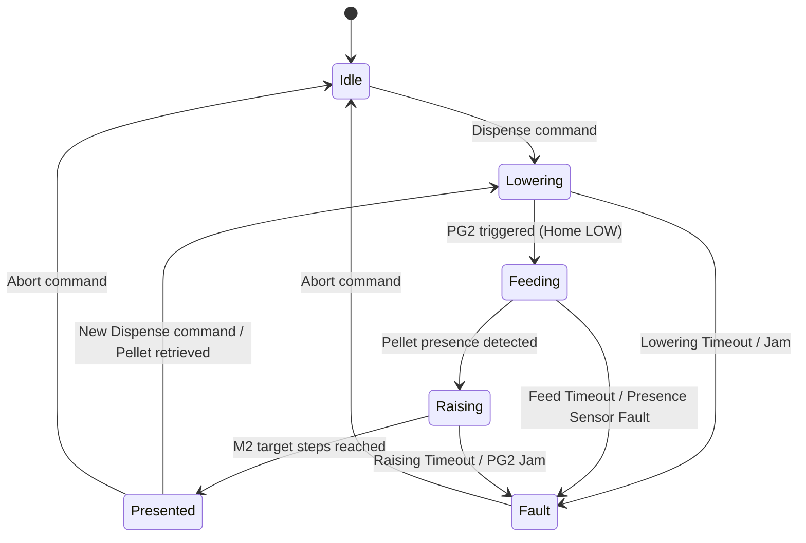

# Function Checks

System-level bring-up and verification procedures to confirm the platform is healthy before an experiment.

> [!NOTE]
> This procedure evaluates the platform from a **whole-system perspective** (Base Station + connected VFM Node array). It assumes that the `CanNode` (VFM) firmware is already flashed to all nodes.

---

## 1. System power-on & LED status check

Power on the 12 V power supply (daisy-chained to all modules) and boot the Raspberry Pi base station. Observe the **Status LED** on each connected module across the arena:

| Phase | Status LED | Meaning |
| :---- | :--------- | :------ |
| **Booting** | Slow blink (1 s) | `begin()` executing; hardware initializing |
| **Waiting for discovery** | Slow blink (1 s) | CAN controller active, awaiting AEI signal from base station |
| **Unassigned (no ID)** | **Continuous slow blink** | Node has no saved NVS ID; awaiting base station AEI HIGH pulse |
| **ID assigned & online** | **Off** | Node assigned valid CAN Node ID, heartbeat active, operational |
| **Fault** | Red blink pattern | Active sticky fault (Jam, Timeout); see [`failure-modes.md`](failure-modes.md) |
| **Warning** | Yellow blink pattern | Non-sticky warning (e.g. dome held open > 30 s) |

> [!IMPORTANT]
> If a module's status LED blinks continuously after power-on, it is waiting for ID assignment. This is normal behavior prior to the base station initiating the discovery FSM and driving the AEI line HIGH.

---

## 2. Automated node discovery & daisy-chain assignment

Connect all modules to the base station in a linear daisy-chain via RJ45 cables. When the base station software initializes:

1. Base station asserts **AEI HIGH** on Module 1.
2. Module 1 FSM transitions: `WaitAEI → CheckNVS`.
   - **First boot (NVS empty)**: Transitions to `Announce`, broadcasts MAC address over CAN, waits for `AssignId` command.
   - **Rejoin boot (NVS has saved ID)**: Transitions to `Rejoin` and immediately asserts AEO HIGH to downstream module.
3. Upon receiving `ASSIGN(MAC, nodeId)`, the module saves its Node ID to NVS, turns **off** its status LED, and propagates AEO HIGH to Module 2.
4. The process repeats sequentially down the chain until all $N$ modules are assigned IDs and emitting CAN heartbeats (`0x200 + nodeId`) every ~5 s.

**Expected result**: All module status LEDs turn off; all connected nodes appear online in the base station GUI grid.

---

## 3. GUI node status monitoring

The base station GUI (`tools/dev_gui` or system dashboard) receives live telemetry and heartbeats from all nodes on the bus. Each node's card displays its real-time VFM state machine status:

| GUI Node State | Description |
| :------------- | :---------- |
| **Idle** | Node online, in standby position; ready for dispense commands |
| **Lowering** | Actuator (M2) lowering to home position until home position sensor (PG2) triggers |
| **Feeding** | Feed motor (M1) rotating until pellet presence sensor confirms pellet at presentation stage |
| **Raising** | Actuator (M2) raising pellet by target steps (`raiseSteps`, ~700 steps) to presentation port |
| **Presented** | Pellet presented at port; spring access sensor detects catch attempts and pellet presence sensor confirms retrieval |
| **SeekingAway** | Actuator (M2) moving up away from home until PG2 clears (recovery/clear motion) |
| **Fault** | Sticky error state (Jam, Timeout); requires an `Abort` command from GUI to reset |
| **Offline** | Watchdog state: base station received no heartbeat for > 15 s (card highlighted red) |

---

## 4. System-wide bus ping & spatial location check

From the base station GUI, issue a **Ping All** command (`CanCmd::Ping` broadcast) or target individual Node IDs:

1. Every active node responds with a `Pong` event (`CanEvent::Pong`) containing its **MAC address** and **Node ID**, which populates the GUI event log.
2. The target node executes a **fast LED blink** pattern on its status LED, allowing visual verification of physical node locations within the arena.

> [!TIP]
> Use Ping All prior to an experiment to verify full CAN bus reachability across all nodes simultaneously and confirm that Node IDs match physical cage positions.

---

## 5. System dispense sequence & sensor verification

Trigger a dispense cycle from the base station GUI (individual module test or sequence across the array). Verify that the system executes the full VFM dispense sequence and sensor transitions:



### Dispense sequence phases

1. **Lowering**: Base station sends `Dispense`. Actuator motor (M2) runs DOWN until **PG2 (home position sensor)** is tripped (LOW).
2. **Feeding**: Feed motor (M1) rotates to advance a pellet. The **pellet presence sensor** detects and verifies pellet presence at the presentation stage.
3. **Raising**: Actuator motor (M2) runs UP for `raiseSteps` (bench default: 700 steps) to elevate the pellet to the presentation port.
4. **Presented**: Pellet is held at the presentation port. The node latches a `PelletPresented` CAN event (`0x300 + nodeId`) and increments its internal pellet count. The **spring-loaded access port mechanism** detects animal access and catch attempts. Upon an access attempt (spring trigger), the **pellet presence sensor** instantly evaluates pellet presence with confidence, determining whether the pellet was successfully retrieved or missed.
5. **Cycle completion / Next trial**: A subsequent `Dispense` command or confirmed pellet retrieval transitions the node directly from `Presented` into `Lowering` for the next pellet, while an `Abort` command returns the node to `Idle`.

---

## 6. Base station hardware & driver validation

Verify the base station hardware (Raspberry Pi 5 + CAN HAT) and host software stack:

### Interactive HAT validation (`test_hat.py`)

Run the automated interactive bring-up tool on the Raspberry Pi:

```bash
python tests/test_hat.py
```

The checklist validates all base-station hardware interfaces:

| Section Flag | Hardware / Interface Validated |
| :----------- | :----------------------------- |
| `can` | SPI/MCP2515 interface, CAN loopback self-test, live node discovery |
| `aeo` | AEO (GPIO27) daisy-chain enable output drive |
| `bnc_out` | BNC OUT (GPIO6) pulse timing and idle state |
| `bnc_in` | BNC IN 1 / BNC IN 2 (GPIO12/13) edge detection & level sensing |
| `button` | User button (GPIO3) input |
| `full_loop` | End-to-end loopback: BNC IN 1 → CAN broadcast dispense → BNC OUT pulse |

### Host software pytest suite

Execute the unit and protocol test suite on the base station (no hardware required):

```bash
cd tools/dev_gui
pip install pytest
python -m pytest tests/ -v
```

| Test File | Scope |
| :-------- | :---- |
| `test_app.py` | GUI application lifecycle |
| `test_discovery_manager.py` | Node discovery state machine logic |
| `test_hat.py` | Interactive HAT hardware validation |
| `test_log_manager.py` | CSV event logging and timestamping |
| `test_mac_id_registry.py` | Persistent MAC-to-Node ID mapping |
| `test_node_registry.py` | Node FSM registry and heartbeat watchdog |
| `test_protocol.py` | CAN frame encoding/decoding |
| `test_schedule.py` | Session scheduling and task execution |

---

## 7. End-to-end system bring-up checklist

Perform this full system check before initiating an experimental session:

1. **Power & Bus**: Turn on 12 V power supply and boot Raspberry Pi base station.
2. **Launch GUI**: Start the base station software (`python run.py`).
3. **Verify Discovery**: Confirm all connected nodes complete daisy-chain assignment, appear in the GUI grid with correct Node IDs, and status LEDs turn OFF.
4. **Bus Reachability (`Ping All`)**: Trigger `ping_all` from GUI; verify all nodes fast-blink status LEDs and emit `Pong` events.
5. **Dispense Cycle Verification**: Trigger a dispense on each module; verify state machine sequence: `Idle → Lowering → Feeding → Raising → Presented`.
6. **BNC Synchronization**: Send a test pulse to BNC IN 1; confirm edge is recorded in the GUI log and BNC OUT pulse is generated.
7. **Offline Watchdog Test**: Disconnect an RJ45 cable from one module; confirm GUI updates node state to **Offline** within ~15 s.
8. **Rejoin Verification**: Reconnect the RJ45 cable; confirm node auto-rejoins and returns to **Idle**.

### Simulated system test (software-only mode)

To verify host software functionality without physical hardware attached:

```bash
# Setup virtual CAN interface
sudo modprobe vcan
sudo ip link add dev vcan0 type vcan
sudo ip link set up vcan0

# Terminal 1 — launch node simulator (e.g. 9 nodes)
python node_simulator.py --interface vcan0 --nodes 9

# Terminal 2 — launch GUI connected to vcan0
python run.py --interface vcan0 --nodes 9
```

---

## 8. Standalone bench troubleshooting reference

If a specific module fails system checks, detach the module for bench testing using standalone sketches in `examples/Troubleshooting/HardwareExamples/`:

| Sketch | Target Subsystem Check |
| :----- | :--------------------- |
| `CanBusTest.ino` | TWAI/CAN transceiver hardware, frame TX/RX, bus termination |
| `LEDTest.ino` | Status LED, green/yellow/red LED drive patterns |
| `SensorTest.ino` | Pellet presence sensor, home position sensor (PG2), and spring access trigger outputs |
| `StepperMotorTest.ino` | M1 (feed) and M2 (actuator) stepper motor drivers and step counts |

---

## 9. Pass / fail criteria

| Verification Step | Pass Criteria | Fail Criteria |
| :---------------- | :------------ | :------------ |
| **Node Discovery** | All status LEDs turn **OFF** after ID assignment | LED continues blinking indefinitely |
| **GUI Node State** | Live state reflects exact node FSM (`Idle`, `Lowering`, `Feeding`, `Raising`, `Presented`) | Card stuck on `Offline`, `Fault`, or state mismatch |
| **Ping Response** | Target node fast-blinks LED; `Pong` frame logged within 2 s | No response; MAC missing in log |
| **Dispense Sequence** | Smooth transition `Idle → Lowering → Feeding → Raising → Presented`; pellet detected by pellet presence sensor; confident retrieval verification via spring access trigger | Motor stall, pellet presence sensor timeout, or sticky `Fault` state |
| **CAN Loopback (`test_hat.py`)** | `[PASS] Loopback TX/RX matches` | Mismatched frame data or CAN interface down |
| **BNC Sync Pulse** | BNC OUT pulse width within ±10% of configured width | Missing pulse or incorrect pulse width |
| **Offline Detection** | Disconnected node transitions to **Offline** in ~15 s | Node state remains `Idle` after cable disconnect |

---

## Cross-references

- [`failure-modes.md`](failure-modes.md) — fault catalog, sticky error codes, and LED patterns.
- [`maintenance.md`](maintenance.md) — preventive maintenance and calibration schedules.
- [`architecture.md`](architecture.md) — CAN ID layout, discovery protocol, and system topology.

